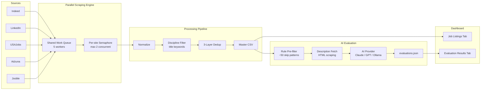

# Pharma/Biotech Job Search Tool

[](https://www.python.org/downloads/)
[](pyproject.toml)
[](LICENSE)
[](https://github.com/BioTechNerd-Apache/pharma-job-search/stargazers)
[](https://github.com/BioTechNerd-Apache/pharma-job-search/commits/main)

A Python CLI + Streamlit dashboard that aggregates pharma/biotech job listings from 5 sources and uses AI to score them against your resume profile. Supports **Anthropic (Claude)**, **OpenAI (GPT)**, and **Ollama (free local models)**.

## How It Works

```
0. SETUP             1. SEARCH          2. FILTER           3. EVALUATE          4. DASHBOARD

Upload resume   ->  Scrape 5 job   ->  Dedup + title   ->  Rule pre-filter  ->  Browse, sort,
AI generates        boards in          keyword filter       + AI scores          and review in
all config          parallel           (keep relevant)      job fit              Streamlit UI
```

**Setup** — upload your resume and the AI wizard generates your entire config (search terms, filters, evaluator patterns). **Search** across Indeed, LinkedIn, USAJobs, Adzuna, and Jooble simultaneously. **Filter** with 3-layer dedup and configurable discipline keywords. **Evaluate** with a 2-stage AI pipeline that skips obvious mismatches and scores the rest against your resume. **Review** everything in an interactive dashboard with color-coded fit scores.

## Screenshots


## Features

- **AI setup wizard**: Upload your resume and the AI generates search terms, filters, evaluator patterns, and resume profile in one step
- **Multi-provider AI**: Choose between Anthropic (Claude), OpenAI (GPT), or Ollama (free local models like Llama 3.1) — separate configs for wizard and evaluation
- **Multi-source aggregation**: Searches Indeed, LinkedIn (via [JobSpy](https://github.com/Bunsly/JobSpy)), USAJobs, Adzuna, and Jooble simultaneously
- **Smart deduplication**: 3-layer dedup (URL, fuzzy company+title+state, cross-source) eliminates duplicate listings
- **Discipline filtering**: Configurable include/exclude keyword filters keep results relevant to your field
- **AI-powered evaluation**: 2-stage pipeline — rule-based pre-filter skips obvious mismatches, then AI scores remaining jobs against your resume profile
- **Interactive dashboard**: Streamlit UI with AG Grid for browsing, filtering, and reviewing jobs across 3 tabs (Listings, Evaluations, Setup)
- **Rolling data**: Merges new results into a master CSV/Excel file, preserving your review history
- **Repost detection**: Tracks when jobs are reposted across sources

## Architecture



## Quick Start

> **New to the command line?** Follow the [step-by-step Installation Guide](docs/INSTALL_GUIDE.md) instead — it covers Windows and Mac with screenshots and troubleshooting.

### 1. Install

**One-command install (any platform):**
```bash
pip install git+https://github.com/BioTechNerd-Apache/pharma-job-search.git
```

This installs all dependencies and creates a `pharma-job-search` CLI command.

**Or clone and install locally:**
```bash
git clone https://github.com/BioTechNerd-Apache/pharma-job-search.git
cd pharma-job-search
pip install -r requirements.txt
```

### 2. Configure

Launch the dashboard and use the **Setup tab** to configure everything through the GUI:

```bash
python job_search.py --web
```

The Setup tab lets you choose an AI provider, upload your resume, run the setup wizard, edit search terms/filters, and manage API keys — all from the browser. `config.yaml` is auto-created on first launch.

<details>
<summary><b>Terminal alternative</b></summary>

```bash
cp config.example.yaml config.yaml          # macOS/Linux
copy config.example.yaml config.yaml         # Windows
python job_search.py --setup resume.pdf      # AI wizard from CLI
```

</details>

> **No AI key?** Use Ollama for free local inference. See [AI Providers](#ai-providers) below.

<details>
<summary><b>Manual setup (alternative to wizard)</b></summary>

Copy and edit the resume profile template:

**macOS / Linux:**
```bash
cp data/resume_profile.example.json data/resume_profile.json
```

**Windows:**
```cmd
copy data\resume_profile.example.json data\resume_profile.json
```

Edit `data/resume_profile.json` with your actual background, and customize search terms/filters in `config.yaml`.

</details>

### 3. Run a search

```bash
python job_search.py --days 1    # Search for jobs posted in the last 24 hours
```

### 4. View the dashboard

```bash
python job_search.py --web
```

> **Dashboard search button:** The dashboard has a "Run New Search" button in the sidebar. Clicking it will scrape all 5 job boards for the last 7 days (the default in `config.yaml`). It does **not** run AI evaluation — that requires the CLI (`python job_search.py --evaluate`). To change the search window, edit the `days` value under `search:` in `config.yaml`.

### 5. Create a desktop shortcut (optional)

```bash
pharma-job-search --create-shortcut   # pip install
python job_search.py --create-shortcut # clone install
```

This creates a platform-appropriate shortcut on your Desktop that launches the dashboard and opens your browser:
- **macOS**: `~/Desktop/Pharma Job Search.command`
- **Windows**: `~/Desktop/Pharma Job Search.bat`
- **Linux**: `~/Desktop/pharma-job-search.desktop`

<details>
<summary><b>Manual shortcut creation</b></summary>

**macOS** — save as `~/Desktop/Pharma Job Search.command`, then `chmod +x` it:
```bash
#!/bin/bash
pharma-job-search --web &
echo 'Waiting for dashboard to start...'
for i in $(seq 1 30); do
  curl -s http://localhost:8501 >/dev/null 2>&1 && break
  sleep 1
done
open http://localhost:8501
```

**Windows** — save as `~/Desktop/Pharma Job Search.bat`:
```batch
@echo off
start "" pharma-job-search --web
echo Waiting for dashboard to start...
:wait_loop
timeout /t 2 /nobreak >nul
curl -s http://localhost:8501 >nul 2>&1 && goto :open_browser
goto :wait_loop
:open_browser
start http://localhost:8501
```

**Linux** — save as `~/Desktop/pharma-job-search.desktop`, then `chmod +x` it:
```ini
[Desktop Entry]
Type=Application
Name=Pharma Job Search
Exec=pharma-job-search --web
Terminal=true
Categories=Utility;
```

> If you cloned the repo instead of pip-installing, replace `pharma-job-search --web` with `python /path/to/job_search.py --web`.

</details>

## AI Providers

The tool supports three AI providers for the setup wizard and job evaluation. You can use different providers for each (e.g., a powerful model for the wizard, a cheap/fast model for bulk evaluation).

| Provider | Cost | Models | Setup |
|----------|------|--------|-------|
| **Anthropic (Claude)** | Paid | claude-haiku-4-5, claude-sonnet-4-5, claude-opus-4 | Get key at [console.anthropic.com](https://console.anthropic.com/settings/keys) |
| **OpenAI (GPT)** | Paid | gpt-4o-mini, gpt-4o, gpt-4.1 | Get key at [platform.openai.com](https://platform.openai.com/api-keys) |
| **Ollama (free)** | Free | llama3.1:8b, gemma3:12b, mistral:7b | Install from [ollama.com/download](https://ollama.com/download), then `ollama pull llama3.1:8b` |

Configure in `config.yaml` under `wizard:` and `evaluation:` sections, or use the dashboard Setup tab.

## API Keys

| Source | Required? | Where to Register |
|--------|-----------|-------------------|
| Indeed | No | Works via JobSpy, no key needed |
| LinkedIn | No | Works via JobSpy, no key needed |
| USAJobs | Optional | [developer.usajobs.gov](https://developer.usajobs.gov/) |
| Adzuna | Optional | [developer.adzuna.com](https://developer.adzuna.com/) |
| Jooble | Optional | [jooble.org/api/about](https://jooble.org/api/about) |
| Anthropic | For AI | [console.anthropic.com](https://console.anthropic.com/settings/keys) |
| OpenAI | For AI | [platform.openai.com](https://platform.openai.com/api-keys) |

You can set API keys in `config.yaml` or via environment variables:
- `ANTHROPIC_API_KEY`, `OPENAI_API_KEY`
- `USAJOBS_API_KEY`, `USAJOBS_EMAIL`
- `ADZUNA_APP_ID`, `ADZUNA_APP_KEY`
- `JOOBLE_API_KEY`

**Note**: Indeed and LinkedIn work without any API keys. You can start searching immediately after install. For AI features, you can use Ollama for free local inference — no API key needed.

## CLI Reference

### Setup

```bash
python job_search.py --setup resume.pdf   # AI wizard: generates all config from resume
```

### Search Commands

```bash
python job_search.py                    # Full search (default: last 7 days)
python job_search.py --days 1           # Last 24 hours
python job_search.py --days 14          # Last 2 weeks
python job_search.py --reprocess        # Re-filter/dedup from raw data (no scraping)
python job_search.py --web              # Launch dashboard only
python job_search.py --create-shortcut  # Create desktop shortcut
```

### Evaluation Commands

```bash
python job_search.py --evaluate               # Search + evaluate new jobs
python job_search.py --evaluate-only           # Evaluate without searching
python job_search.py --eval-days 3            # Evaluate jobs from last 3 days
python job_search.py --eval-all               # Evaluate all unevaluated jobs
python job_search.py --eval-prefilter-only    # Rule-based filter only (no API cost)
python job_search.py --eval-dry-run           # Show count + cost estimate
python job_search.py --eval-summary           # Show evaluation statistics
python job_search.py --eval-export results.csv --eval-min-score 60  # Export results
python job_search.py --re-evaluate            # Force re-evaluation of scored jobs
```

## Dashboard

The Streamlit dashboard has three tabs:

- **Job Listings**: Browse all scraped jobs with sortable/filterable AG Grid. Mark jobs as reviewed.
- **Evaluation Results**: View AI-scored jobs with color-coded fit scores (green = strong fit, red = poor fit).
- **Setup**: Configure AI providers (wizard + evaluation), run the setup wizard, edit search terms/filters/patterns, and manage your resume profile.

Both job tabs share the review system — select rows and click "Mark Reviewed" to track which jobs you've looked at.

## Customization Guide

This tool ships pre-configured for **pharma/biotech scientist** roles. There are 4 layers to customize for your background:

### Layer 1: Search Terms (`config.yaml` → `search.terms` + `search.synonyms`)

**What they do**: These keywords are sent to job boards. Each term in `synonyms` auto-expands — e.g., searching for "cell gene therapy" also searches "CGT scientist", "CAR-T scientist", "gene therapy", "cell therapy".

**To customize**: Replace terms with your discipline's job titles and keywords. The synonym groups reduce the number of base terms you need.

### Layer 2: Discipline Filters (`config.yaml` → `search.filter_include` + `search.filter_exclude`)

**What they do**: After scraping, jobs are filtered by **title only** (not description — this prevents false positives). A job must match at least one `filter_include` keyword AND match zero `filter_exclude` keywords to be kept.

**To customize**: Replace include keywords with terms relevant to your field. The exclude list filters out irrelevant roles (sales, nursing, IT, etc.) — most of it is broadly useful, but review it for your domain.

### Layer 3: Pre-filter Patterns (`data/evaluator_patterns.yaml`)

**What they do**: Before sending jobs to the AI for scoring (which costs money), a rule-based pre-filter runs:
- **Skip patterns** (~50 regex patterns on title, ~15 on description): Auto-skip obvious mismatches (e.g., VP roles, QC technicians, HPLC-focused positions, data scientists)
- **Rescue patterns** (~15 patterns): Override skips — if a job matches both skip AND rescue (e.g., "HPLC" in description but also "qPCR"), it is NOT skipped
- **Boost patterns** (~15 patterns): Jobs matching these get evaluated first (e.g., bioanalytical, gene therapy, CAR-T)

**To customize**: The setup wizard generates `data/evaluator_patterns.yaml` tailored to your resume. You can also edit patterns in the dashboard Setup tab, or hand-edit the YAML. If the YAML file doesn't exist, built-in defaults are used. Run `--eval-prefilter-only` to test your patterns without API cost.

### Layer 4: Resume Profile (`data/resume_profile.json`)

**What they do**: The AI evaluator (Claude Haiku) reads this profile to score how well each job matches your background. The profile includes your career history, technical platforms, regulatory experience, and fit domains.

**To customize**: Copy `data/resume_profile.example.json` to `data/resume_profile.json` and fill in your actual background. Key fields:

| Field | Purpose |
|-------|---------|
| `career_anchors` | Your work history — skills at each position |
| `core_technical_platforms` | Instruments/techniques you know |
| `regulatory_framework` | GLP, GMP, FDA experience etc. |
| `strongest_fit_domains` | Job types that match you best (scored highest) |
| `moderate_fit_domains` | Decent matches (scored moderately) |
| `skip_domains` | Poor matches (scored low) |
| `never_claim` | Skills/platforms you do NOT have (prevents false matches) |

### Getting Started Without API Keys

You can run a basic search with **zero API keys** — Indeed and LinkedIn work immediately via JobSpy:

```bash
pip install git+https://github.com/BioTechNerd-Apache/pharma-job-search.git
cp config.example.yaml config.yaml
pharma-job-search --days 1             # Scrapes Indeed + LinkedIn
pharma-job-search --web                # View results in dashboard
```

Add USAJobs/Adzuna/Jooble keys for more sources. For AI features (setup wizard + evaluation), use an Anthropic/OpenAI key or install [Ollama](https://ollama.com/download) for free local inference.

## Project Structure

```
job_search.py                # CLI entry point
pyproject.toml               # Package config (pip installable)
config.yaml                  # Your configuration (not tracked by git)
config.example.yaml          # Template configuration
src/
  config.py                  # YAML loader + dataclasses (AppConfig, WizardConfig, EvaluationConfig)
  ai_client.py               # Multi-provider AI client (Anthropic, OpenAI, Ollama)
  setup_wizard.py            # AI-powered setup wizard (resume → full config)
  resume_parser.py           # Resume text extraction (PDF, DOCX, TXT)
  pattern_helpers.py         # Regex ↔ display string conversion for pattern editor
  aggregator.py              # Orchestrator with parallel scraping
  dedup.py                   # 3-layer deduplication
  exporter.py                # CSV/Excel merge-on-save
  dashboard.py               # Streamlit UI with AG Grid (3 tabs)
  scraper_jobspy.py          # Indeed/LinkedIn via python-jobspy
  scraper_usajobs.py         # USAJobs REST API
  scraper_adzuna.py          # Adzuna REST API
  scraper_jooble.py          # Jooble REST API
  evaluator.py               # 2-stage evaluation pipeline
  eval_persistence.py        # JSON persistence for evaluations
  description_fetcher.py     # HTML scraping for job descriptions
  resume_profile.py          # Resume profile loader
tests/
  test_evaluator.py          # Tests for rule-based pre-filter
  test_ai_client.py          # Tests for multi-provider AI client
  test_setup_wizard.py       # Tests for setup wizard
  test_resume_parser.py      # Tests for resume text extraction
  test_pattern_helpers.py    # Tests for regex display helpers
data/
  resume_profile.json        # Your resume profile (generated/not tracked)
  resume_profile.example.json # Template resume profile
  evaluator_patterns.yaml    # Evaluator patterns (generated/not tracked)
  pharma_jobs.csv            # Master job data (generated)
  pharma_jobs.xlsx           # Master job data (generated)
docs/
  CLAUDE.md                  # Full project instructions for AI assistants
  PROJECT_REFERENCE.md       # Complete source code reference
  PRD.md                     # Product requirements document
```

## Requirements

- Python 3.10+
- macOS, Linux, or Windows
- Dependencies are installed automatically via `pip install`; see [`pyproject.toml`](pyproject.toml) or `requirements.txt` for the full list
- For AI features: an API key for Anthropic or OpenAI, **or** [Ollama](https://ollama.com/download) installed locally (free)

## Contributing

See [CONTRIBUTING.md](CONTRIBUTING.md) for how to set up a dev environment, customize for your discipline, and submit changes.

## License

MIT License. See [LICENSE](LICENSE) for details.
